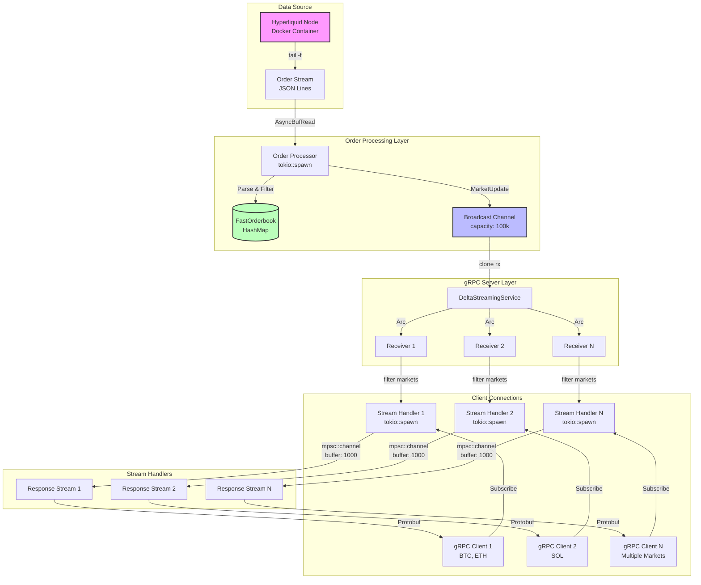
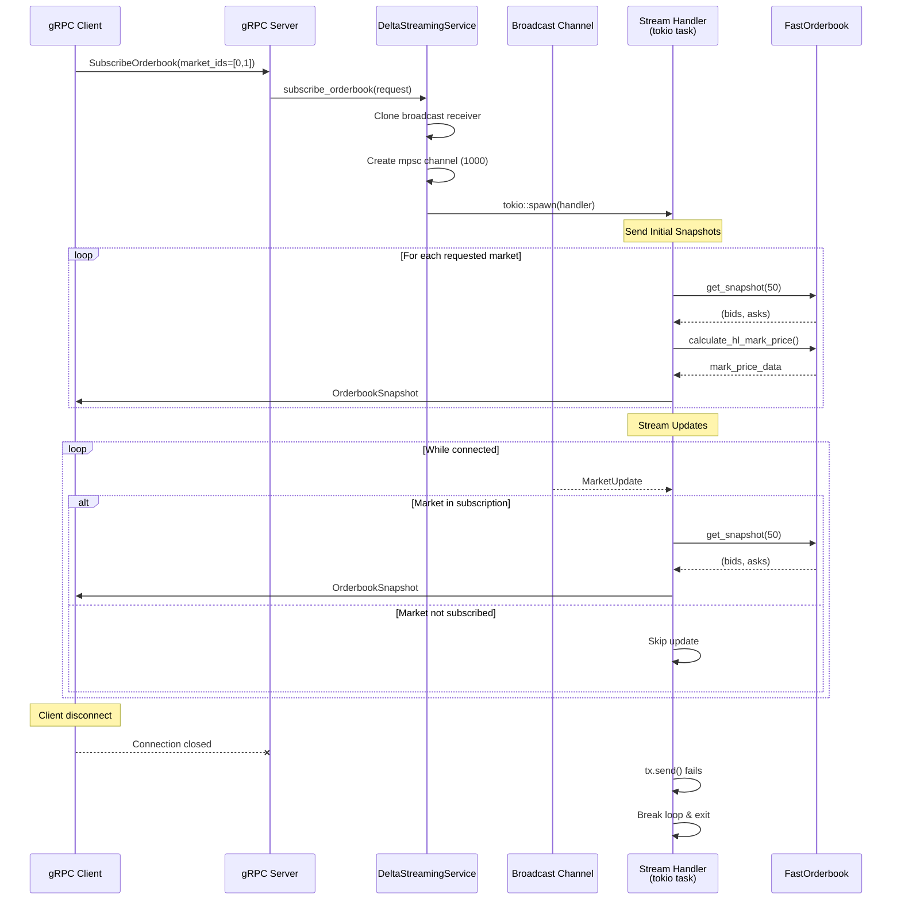
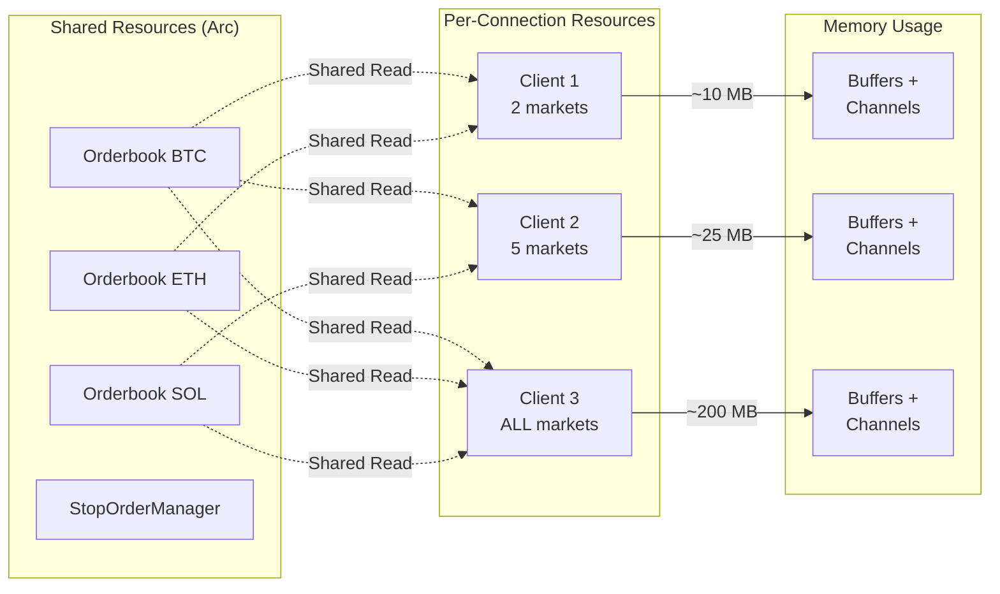
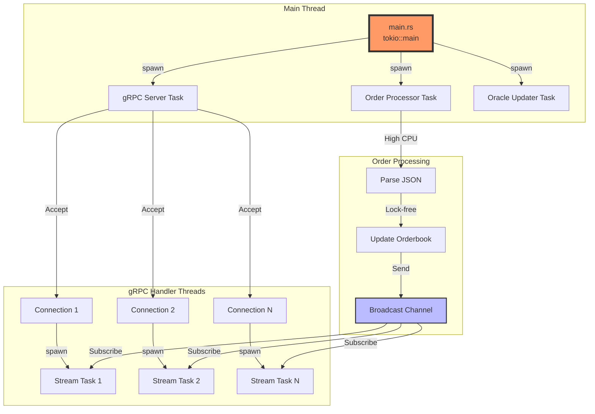

# gRPC Server Connection Architecture

## High-Level Architecture Diagram



## Detailed Connection Flow



## Connection Lifecycle

```mermaid
stateDiagram-v2
    [*] --> Connecting: Client connects
    Connecting --> Authenticated: TLS/Auth (if enabled)
    Authenticated --> Subscribing: SubscribeOrderbook RPC
    Subscribing --> Streaming: tokio::spawn handler
    
    Streaming --> Streaming: Receive updates
    Streaming --> Disconnecting: Client disconnect
    Streaming --> Disconnecting: Server shutdown
    Streaming --> Disconnecting: Send error
    
    Disconnecting --> [*]: Cleanup resources

    note right of Streaming
        - Filter by market_ids
        - Buffer up to 1000 messages
        - Backpressure handling
    end note
```

## Resource Management



## Concurrency Model



## Key Design Patterns

### 1. **Broadcast Fan-out Pattern**
- Single producer (order processor)
- Multiple consumers (client handlers)
- Each client gets own receiver clone
- Lagging receivers drop messages

### 2. **Shared Immutable State**
- Orderbooks wrapped in `Arc`
- Read-only access from handlers
- Updates only from order processor
- Lock-free reads

### 3. **Backpressure Handling**
```rust
// Each client has bounded channel
let (tx, rx) = mpsc::channel(1000);

// Graceful degradation
if tx.send(snapshot).await.is_err() {
    // Client can't keep up, disconnect
    break;
}
```

### 4. **Resource Isolation**
- Each connection runs in separate task
- Panic in one doesn't affect others
- Independent message buffers
- No shared mutable state

## Scalability Limits

| Component | Limit | Bottleneck |
|-----------|-------|------------|
| Broadcast Channel | ~10K receivers | Memory/CPU for cloning |
| Connections | ~50K concurrent | File descriptors |
| Markets per client | 199 (all) | Network bandwidth |
| Updates/second | ~100K | Broadcast distribution |
| Orderbook depth | Unbounded* | Memory growth |

*Currently unbounded, should be limited in production

## Performance Characteristics

```
┌─────────────────┐
│ Order Arrival   │ ~100μs  Parse JSON
│                 │ ~10μs   Update orderbook  
│                 │ ~5μs    Broadcast send
└────────┬────────┘
         │
┌────────▼────────┐
│ Client Update   │ ~50μs   Filter & serialize
│                 │ ~100μs  Network send
│                 │ ~20μs   Protobuf encode
└─────────────────┘

Total Latency: ~300μs (typical)
              ~1ms (99th percentile)
```